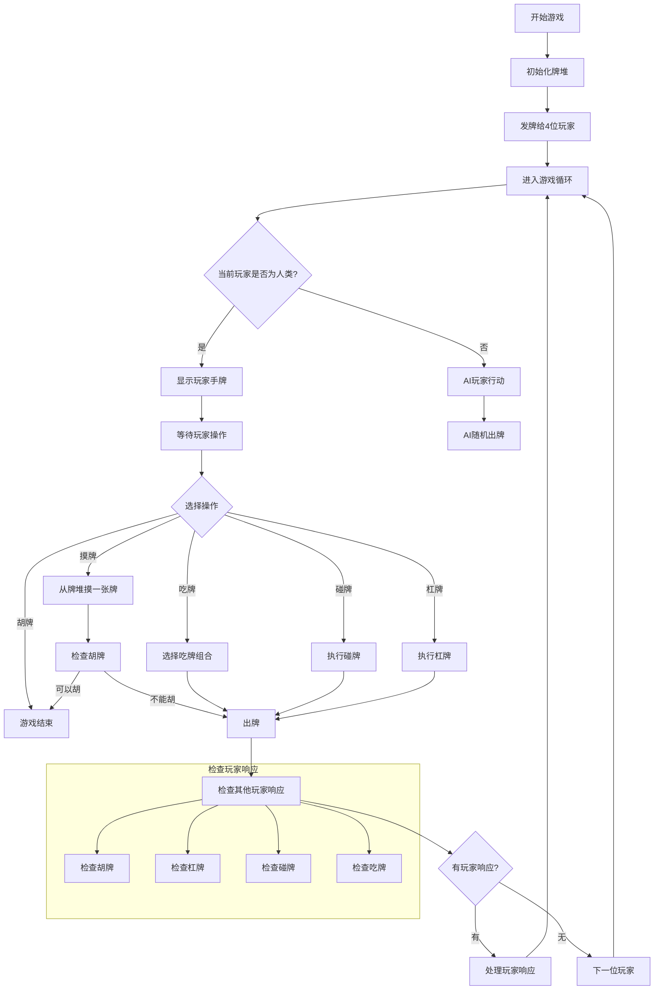

# 计算概论B大作业——麻将
物理学院 2400011527 侯佳奇
2025年1月3日
[TOC]

## 具体思路
### 定义MahjongGame类
**1. 初始化**
- 使用`initialize_deck()`初始化牌堆，使用`random`自带的`random.shuffle()`进行洗牌  
- 初始化玩家，每个玩家有`hand`, `sunband`, `discards`, `draw`四个属性（通过字典进行存储），初始化玩家序号为0（用户先摸牌出牌）   
- 使用`initialize_hands()`初始化四个玩家的手牌，使用`pop()`直接从已经洗牌的牌堆顶部抽取  
- 使用`sort_tiles()`对玩家手牌进行排序（按照S,M,P，1~9的顺序）

**2. 交互界面的显示与清除**
- `display_info()`用于在屏幕上显示用户id，当前玩家id,用户手牌、副露，剩余牌数  
例如下面：
```
用户ID: 0
当前玩家ID: 0
用户手牌: ['S1', 'S5', 'S6', 'S7', 'S9', 'M3', 'M4', 'M6', 'M8', 'M9', 'P3', 'P4', 'P8']
用户副露: []
剩余牌数: 56

您摸到了: S4
请输入操作 ['1:弃牌', '2:查询']:
```

- `clear_screen()`使用`python`标准库`os`里面的`system("cls")`清楚终端的所有内容（windows为cls,macOs、Linux为clear）

**3. 操作的实现**
- 摸牌：从牌堆顶端`pop()`一张牌  
- 弃牌：`discard_tile()`用于机械式进行弃牌操作，弃牌从手牌移除,该玩家`"draw"`清空，`player_discard()`处理玩家的弃牌操作，使用`while`循环，如果玩家输入回车或者正确的手牌，那么弃牌并且`break`跳出，如果不正确，那么显示需要再次输入，再次循环，直到用户输入正确的牌。
例如下面：
```
用户ID: 0
当前玩家ID: 0
用户手牌: ['S1', 'S2', 'S4', 'S4', 'S7', 'S8', 'M9', 'P3', 'P4', 'P5', 'P8', 'P9', 'P9']
用户副露: []
剩余牌数: 56

您摸到了: P3
请输入操作 ['1:弃牌', '2:查询']: 1
请选择你需要切出的牌 (直接按回车可切出刚摸到的牌):
M9
玩家0打出了M9
按回车键继续...
```
<br/>

- **获取玩家摸牌操作后的合法操作`get_available_actions()`**
    - **判断能否自摸胡牌`can_hu()`：（核心算法）**
    玩家副露已经满足顺子或刻子，在手牌中判断手牌是不是和牌类型，使用回溯算法，先减去可能的对子，接着需要使用下面定义的`is_valid_hand()`  
        - `is_valid_hand()`用于判断几张牌是否满足“（刻子）+（顺子）”，使用回溯算法先尝试第一张牌能不能组成刻子，如果能，减去刻子，对剩余牌进行判断；如果不能组成刻子，尝试组成顺子，如果能，减去顺子，对剩余牌进行判断；如果也不行，那么不能形成胡牌，`return False`  
    ```
    用户ID: 0
    当前玩家ID: 1
    用户手牌: ['S4', 'S4', 'M3', 'M3', 'M3', 'P4', 'P4']
    用户副露: [['M4', 'M4', 'M4'], ['S6', 'S7', 'S8']]
    剩余牌数: 42
    
    
    玩家1打出了：S4
    ------------------------------
    请选择操作：
    0:胡牌, 1:吃牌, 2:碰牌, 3:明杠, 4:忽略
    ------------------------------
    请输入操作编号(0-4): 0
    ```
    
    - **判断能否明杠`can_gang0()`:**
    摸牌后玩家可能形成四张一样的牌，遍历手牌寻找是否存在四张一样的牌
    - **判断能否补杠`can_gang2()`:**
    判断手中是否有和副露中刻子一样的牌
    <br/>

- 通过上面的判定，把可以的操作加入到`get_available_actions()`中局部变量`actions=[]`中，并且屏幕上显示这些操作  
<br/>

- **用户的回合`user_turn()`**
    - 清除屏幕、显示信息、摸牌、显示摸牌信息
    - 通过`get_available_actions()`的判定，把可以的操作加入到`get_available_actions()`中局部变量`actions=[]`中，并且屏幕上显示这些操作,然后获取用户输入，判断是否合法，合法就执行，不合法提示重新输入。
    - **查询功能实现`query()`**
    先输入一个数字代表查看牌河(1)还是副露(2),然后冒号隔开，输入的第二个数是玩家id(0~3)。  
    <br/>

- **电脑玩家回合操作`computer_turn()`**
电脑玩家的逻辑较为简单，摸牌，并且能和就和，使用random随机弃牌
<br/>

- **检查有人出牌后，场上有没有其他操作`check_actions()`**
简单起见，按照逆时针顺序处理
用户可以自由选择胡、杠、碰、吃、忽略等等操作
电脑玩家自动选择：胡 > 杠 > 碰 > 吃 > 忽略
    - **判断能否点炮和牌`can_hu_by_tile()`**
    在加入其他玩家打出的牌之后形成的牌，继续使用`is_valid_hand()`检查是否构成胡牌类型
    - **判断能否碰牌`can_pang()`**
    检查玩家手牌中该张牌的数量是否大于等于2
    - **判断能否补杠`can_gang1()`**
    检查玩家手牌中该张牌的数量是否等于3  
    - **判断能否吃牌`can_chi()`**
    检查玩家手牌中是否存在能包含这张牌的顺子
    <br/>
    - **进行碰操作`peng()`**
    手牌移除相应的牌，副露增添这个刻子，并且显示相关信息。回合来到了该玩家，该玩家接下来弃一张牌，然后继续下面的操作。
    ```
    #显示信息忽略

    玩家2选择了碰牌

    玩家2碰了玩家3的 M5
    移除的牌: M5, M5
    形成的碰牌组合: [M5, M5, M5]
    按回车键继续...
    ```

    - **进行吃操作`chi()`**
    执行吃牌操作，将指定的牌加入副露，并从手牌中移除相应的牌。
    
    ```
    #显示信息已忽略

    玩家3打出了：S9
    ------------------------------
    请选择操作：
    0:胡牌, 1:吃牌, 2:碰牌, 3:明杠, 4:忽略
    ------------------------------
    请输入操作编号(0-4): 1
    可选的顺子组合：
    1: S7 S8 S9
    请输入你要吃的顺子(请以空格分开)，或输入'n'取消:
    S7 S8 S9
    ```

    - **进行明杠操作`gang1()`**
    执行明杠操作，将指定的牌加入副露，并从手牌中移除相应的牌.
    - **进行暗杠操作`gang0()`**
    执行暗杠操作，将指定的牌加入副露，并从手牌中移除相应的牌。
    - **进行补杠操作`gang2()`**
    执行补杠操作，将指定的牌加入副露，并从手牌中移除相应的牌。
        - **杠操作之后`turn_after_action()`**，再`gang0`, `gang1`, `gang2()`内部
    由于杠之后可以摸牌，并且可以胡牌，所以专门定义一个杠后函数，先摸牌，再判断是否能胡牌，若没有和牌，需要弃一张牌。

    - **玩家操作之后的回合`turn_after_action()`**
    首先显示上一名玩家打出的牌，接着如果是用户，用户进行胡牌，弃牌，查询，暗杠，补杠等操作，如果输入不合法，那么便提示用户重新输入。对于电脑玩家，为了简化，只需要进行胡牌判定
    <br/>

- **主函数`play_game()`**
主游戏循环，控制游戏的进行，直到牌堆为空或有玩家胡牌。
如果牌堆发空，还是无人胡牌，游戏结束。我将两个例子（一个获胜，一个牌堆发空）放在后面：
    - `end_game()`当某个玩家胡牌之后，直接触发`end_game()`函数，结束游戏，显示相关信息。
```
牌堆已空，游戏结束。
玩家0的手牌: ['S1', 'S2', 'S3', 'P5', 'P7', 'P8', 'P9']
玩家0的副露: [['S7', 'S8', 'S9'], ['P1', 'P2', 'P3']]
玩家0的弃牌: ['M9', 'S4', 'P3', 'P2', 'M2', 'P9', 'S4', 'S1', 'M6', 'P4', 'M2', 'M7', 'P4', 'P1', 'P3', 'P2']
玩家1的手牌: ['S4', 'S8', 'M1', 'M3', 'M6', 'M7', 'P3', 'P6', 'P8', 'P9']
玩家1的副露: [['M8', 'M8', 'M8']]
玩家1的弃牌: ['P7', 'P1', 'S1', 'P6', 'S8', 'S3', 'S5', 'P5', 'S9', 'S3', 'S1', 'M6', 'S6', 'S5', 'S7']
玩家2的手牌: ['S2', 'S9', 'M1', 'M3', 'M4', 'M4', 'M7']
玩家2的副露: [['M5', 'M5', 'M5'], ['S3', 'S4', 'S5']]
玩家2的弃牌: ['S2', 'M2', 'M7', 'P8', 'M9', 'S6', 'M9', 'M6', 'P6', 'M2', 'S8', 'S6', 'P6', 'P4', 'S2', 'M4']
玩家3的手牌: ['S6', 'S7', 'M4', 'P4', 'P5', 'P5', 'P8']
玩家3的副露: [['P7', 'P8', 'P9'], ['S5', 'S6', 'S7']]
玩家3的弃牌: ['M5', 'S9', 'M9', 'S5', 'S9', 'P1', 'M8', 'M1', 'M1', 'M8', 'P2', 'M3', 'P1', 'M3', 'P7', 'M5']
```
```
玩家0获胜！
玩家0的手牌: ['S4', 'S4', 'S4', 'M3', 'M3', 'M3', 'P4', 'P4']
玩家0的副露: [['M4', 'M4', 'M4'], ['S6', 'S7', 'S8']]
玩家0的弃牌: ['M2', 'M9', 'P1', 'P7', 'S1']
玩家1的手牌: ['S1', 'S3', 'S6', 'S6', 'M1', 'P1', 'P4', 'P6', 'P9', 'P9']
玩家1的副露: [['M7', 'M8', 'M9']]
玩家1的弃牌: ['M7', 'M5', 'S9', 'M5', 'S4']
玩家2的手牌: ['S3', 'S3', 'S9', 'M9', 'M9', 'P1', 'P2', 'P5', 'P6', 'P8']
玩家2的副露: [['M5', 'M5', 'M5']]
玩家2的弃牌: ['M1', 'S8', 'M4', 'M8', 'P7']
玩家3的手牌: ['S1', 'S2', 'S2', 'S2', 'S5', 'S7', 'M2', 'M6', 'P2', 'P5', 'P7', 'P8', 'P8']
玩家3的副露: []
玩家3的弃牌: ['P2', 'M8', 'S8']
```
---
## python网络编程学习

### 端口号与传输层
- 端口号是传输层的概念
- 端口号是一个2字节16位的整数
- 端口号用来标识一个进程，用来告诉OS，将数据交给哪一个进程
- IP地址+端口号可以唯一的表示网络中一个主机的进程
- 一个端口号只能被一个进程占用
### TCP 与 UDP
1. TCP(传输控制协议)
- 传输层协议
- 面向连接，两个主机只有建立连接之后才可以通信
- 可靠传输，建立连接之后，占用端到端的通信资源
- 面向字节流，发送的字节流数据之间没有明确的间隔
2. UDP(用户数据报协议)
- 传输层协议
- 面向无连接，尽最大努力交付(例如：发短信，不管能- 不能收到，都可以发送)
- 不可靠的传输
- 面向数据报，发送的一个数据是一个整体，它们之间有明确的间隔

### Socket套接字
1. Socket是应用层与TCP/IP协议族通信的中间软件抽象层，它是一组接口。在设计模式中，Socket其实就是一个门面模式，它把复杂的TCP/IP协议族隐藏在Socket接口后面，对用户来说，一组简单的接口就是全部，让Socket去组织数据，以符合指定的协议。  
  
  

2. socket(int domain, int type, int protocol)  
- domain为协议域，又称为协议族（family）。
- type：指定socket类型。
- protocol：指定协议。

3. 利用三元组（ip地址，协议，端口）可以标识网络的进程  
当我们调用socket创建一个socket时，返回的socket描述字它存在于协议族（address family，AF_XXX）空间中，但没有一个具体的地址。如果想要给它赋值一个地址，就必须调用bind()函数，否则就当调用connect()、listen()时系统会自动随机分配一个端口。

4. bind()函数  
bind()函数把一个地址族中的特定地址赋给socket。
5. listen()、connect()函数  
如果作为一个服务器，在调用socket()、bind()之后就会调用listen()来监听这个socket，如果客户端这时调用connect()发出连接请求，服务器端就会接收到这个请求。
6. accept()函数  
TCP服务器端依次调用socket()、bind()、listen()之后，就会监听指定的socket地址了。TCP客户端依次调用socket()、connect()之后就想TCP服务器发送了一个连接请求。TCP服务器监听到这个请求之后，就会调用accept()函数取接收请求，这样连接就建立好了。之后就可以开始网络I/O操作了，即类同于普通文件的读写I/O操作。
7. read()、write()等函数  
socket对象类似文件，可以进行读写
8. close()函数  
在服务器与客户端建立连接之后，会进行一些读写操作，完成了读写操作就要关闭相应的socket描述字，好比操作完打开的文件要调用fclose关闭打开的文件。

9. 服务端实例
```
import socket

def start_server():
    # 创建socket对象
    server_socket = socket.socket(socket.AF_INET, socket.SOCK_STREAM)
    
    # 绑定主机和端口
    host = 'localhost'
    port = 9999
    server_socket.bind((host, port))
    
    # 开始监听，最大连接数为5
    server_socket.listen(5)
    print(f"服务器正在监听 {host}:{port}")
    
    while True:
        # 等待客户端连接
        client_socket, addr = server_socket.accept()
        print(f"收到来自 {addr} 的连接")
        
        # 接收数据
        data = client_socket.recv(1024).decode()
        print(f"收到消息: {data}")
        
        # 发送响应
        response = "服务器已收到消息"
        client_socket.send(response.encode())
        
        client_socket.close()

if __name__ == '__main__':
    start_server()
```
10. 客户端实例
```
import socket

def start_client():
    # 创建socket对象
    client_socket = socket.socket(socket.AF_INET, socket.SOCK_STREAM)
    
    # 连接服务器
    host = 'localhost'
    port = 9999
    client_socket.connect((host, port))
    
    # 发送数据
    message = "Hello, Server!"
    client_socket.send(message.encode())
    
    # 接收响应
    response = client_socket.recv(1024).decode()
    print(f"服务器响应: {response}")
    
    client_socket.close()

if __name__ == '__main__':
    start_client()
```

**参考资料：**
[计算机网络的整体学习认知(OSI七层参考模型&TCP/IP四层参考模型)](https://blog.csdn.net/hansionz/article/details/85224786)\
[网络编程套接字(Socket)](https://blog.csdn.net/hansionz/article/details/85226345)\
[socket通讯原理及例程（一看就懂）](https://blog.csdn.net/jiushimanya/article/details/82684525)  
部分代码参考了GitHub Copilot

（由于写文档时使用的是markdown，由于经验不足，导出 pdf 时流程图、图片单独占页，使得内容有较大空白，对阅读产生了一定影响。）